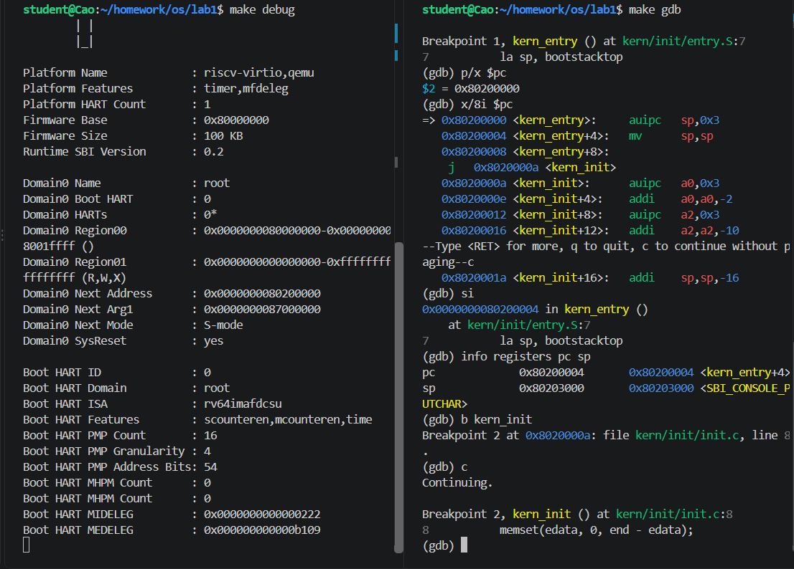

# 操作系统实验报告

## 实验基本信息

| 项目 | 内容 |
|------|------|
| **实验名称** | Lab 1：比麻雀更小的麻雀（最小可执行内核） |
| **小组成员** | 2412940-曹皓轩 |
| **完成日期** | 2026-09-27 |

### 小组分工

| 成员 | 负责的练习/模块 |
|------|----------------|
| 2412940-曹皓轩 | 全部 |

---

## 一、实验目的

实验1主要讲解最小可执行内核和启动流程。我们的内核主要在 Qemu 模拟器上运行，它可以模拟一台 64 位 RISC-V 计算机。为了让我们的内核能够正确对接到 Qemu 模拟器上，需要了解 Qemu 模拟器的启动流程，还需要一些程序内存布局和编译流程（特别是链接）相关知识。

1. 使用 链接脚本 描述内存布局
2. 进行 交叉编译 生成可执行文件，进而生成内核镜像
3. 使用 OpenSBI 作为 bootloader 加载内核镜像，并使用 Qemu 进行模拟
4. 使用 OpenSBI 提供的服务，在屏幕上格式化打印字符串用于以后调试

---

## 二、实验环境


| 成员 | AI 编程工具 | 底层模型 | 备注 |
|------|------------|---------|------|
| 2412940-曹皓轩 | Codex（终端 Agent） | GPT-5.6 |  |

---

## 三、实验整体逻辑分析

### 3.1 本章节的逻辑主线

本实验围绕一个操作系统内核如何从无到有启动展开。内核本身不能在启动前加载自己，所以需要先由 QEMU 的复位代码和 OpenSBI 完成最基础的初始化，再把控制权交给内核。

整个过程可以概括为：

```text
CPU 复位，PC = 0x1000
    -> QEMU 复位代码
    -> OpenSBI 初始化
    -> 内核加载到 0x80200000
    -> kern_entry 设置内核栈
    -> kern_init 执行初始化
    -> 通过 SBI 输出启动信息
    -> 内核进入死循环
```

### 3.2 功能的逐步实现

1. **链接和生成内核镜像**：`tools/kernel.ld` 将内核入口安排在 `0x80200000`，Makefile 再将 ELF 文件转换成 QEMU 使用的二进制镜像。
2. **进入汇编入口**：OpenSBI 跳转到 `kern_entry`，也就是 `entry.S` 中的第一条指令。
3. **建立内核栈**：`la sp, bootstacktop` 将栈指针设置到预留内核栈的顶部，为执行 C 代码做准备。
4. **进入 C 语言初始化函数**：`tail kern_init` 跳转到 `kern_init`，完成 `.bss` 清零和启动信息输出。
5. **完成字符输出**：`cprintf` 经过控制台封装，最终通过 `ecall` 请求 OpenSBI 输出字符。
6. **使用 GDB 验证**：从 `0x1000` 开始观察复位代码，并在 `0x80200000` 设置断点，确认控制权确实交给了内核。

---

## 四、实验内容与实现

### 功能模块：内核构建和启动

**负责人：** 2412940-曹皓轩

#### 模块功能描述

Makefile 负责编译 C 和汇编源文件、链接目标文件，并生成 `bin/kernel` 和 `bin/ucore.img`。链接脚本规定内核的入口地址为 `kern_entry`，加载地址为 `0x80200000`。

本机 QEMU/OpenSBI 版本使用原来的 `-device loader` 参数时没有正确设置 OpenSBI 的下一跳地址，因此将 `Makefile` 中的 QEMU 参数调整为 `-kernel $(UCOREIMG)`。调整后，OpenSBI 能正常跳转到内核入口。

涉及的主要文件：

- `Makefile`
- `tools/kernel.ld`
- `kern/init/entry.S`
- `kern/init/init.c`
- `libs/sbi.c`
- `kern/driver/console.c`
- `kern/libs/stdio.c`

#### 最终提示词

````markdown
[PROMPT]
任务：完成 Lab1最小可执行内核的构建、启动和调试验证。阅读当前项目中的实验文档和源代码，确认内核能够被交叉编译、链接并生成 QEMU 可运行的镜像；使用 QEMU 启动内核，并使用 RISC-V GDB 跟踪 CPU 从复位地址 0x1000 到内核入口 0x80200000 的过程。

操作要求：你必须在当前项目中执行实际的编译、运行和调试命令，并根据真实输出判断结果。可以在确有必要时修改 Makefile 的 QEMU 启动参数以适配当前 QEMU/OpenSBI 版本，但不要修改实验核心代码或引入与本实验无关的功能。所有关键地址、寄存器值和函数位置都必须通过 QEMU、GDB 或符号表实际验证，不能凭空假设。

输出要求：说明实验的启动流程，回答 entry.S 中 la sp, bootstacktop 和 tail kern_init 的作用；记录 GDB 的关键命令、观察结果和问题答案；最后给出简洁的测试结论。报告内容以当前项目的真实代码和实际运行结果为准。

[RELY]
lab1下所有源文件

[GUARANTEE]
本任务必须完成和验证的主要接口、目标和结果：

make
make qemu
make debug
make gdb
kern_entry
kern_init

必须满足：

成功生成 bin/kernel 和 bin/ucore.img
QEMU 启动后能够输出 (THU.CST) os is loading ...
GDB 连接后初始 PC 为 0x1000
程序能够从复位代码经过 OpenSBI 到达内核入口 0x80200000
能够验证 kern_entry 设置了有效的内核栈，并跳转到 kern_init
能够记录复位代码的主要指令、关键寄存器值和最终调试结论

[SPECIFICATION]

````

#### 实现迭代过程

本模块经历了两步验证：

##### 第一次迭代

执行：

```bash
make
make qemu
```

编译成功，但使用原来的 `-device loader` 启动时，OpenSBI 输出的 `Next Address` 没有设置为内核入口，QEMU 没有继续执行内核。

##### 第二次迭代

将 QEMU 启动参数改为：

```makefile
-kernel $(UCOREIMG)
```

重新测试后，OpenSBI 输出：

```text
Domain0 Next Address      : 0x0000000080200000
Domain0 Next Mode         : S-mode
(THU.CST) os is loading ...
```

说明内核已经成功启动。随后使用 GDB 验证了 `0x1000`、`0x80200000` 和 `kern_init` 等关键位置。

---

### 练习一：理解内核启动中的程序入口操作

**负责人：** 2412940-曹皓轩

#### 1. `la sp, bootstacktop`

`la` 是加载地址的伪指令。这条指令将符号 `bootstacktop` 的地址加载到栈指针寄存器 `sp` 中。

在 `entry.S` 中，内核通过下面的代码预留栈空间：

```assembly
bootstack:
    .space KSTACKSIZE
bootstacktop:
```

RISC-V 栈通常从高地址向低地址增长，所以把 `sp` 设置为 `bootstacktop`，就可以从栈空间的顶部开始使用。进入 C 语言函数前必须先有一个有效的栈，否则函数调用、局部变量和寄存器保存都无法正常工作。

本次编译中，GDB 观察到：

```text
sp = 0x80203000
```

这个地址就是 `bootstacktop`。

#### 2. `tail kern_init`

`tail kern_init` 是尾调用伪指令，作用是跳转到 `kern_init`，但不保存返回地址。它适合这里的启动流程，因为 `kern_entry` 完成栈初始化后不需要返回，而 `kern_init` 本身也不会返回，最后会进入死循环。

反汇编结果中，它被展开为直接跳转：

```text
0x80200008: j 0x8020000a <kern_init>
```

---

### 练习二：使用 GDB 验证启动流程

**负责人：** 2412940-曹皓轩

#### 调试过程

终端一启动 QEMU 调试模式：

```bash
make debug
```

终端二连接 GDB：

```bash
make gdb
```

GDB 连接成功后，初始状态为：

```text
Remote debugging using localhost:1234
0x0000000000001000 in ?? ()
```

说明 CPU 复位后从地址 `0x1000` 开始执行。使用：

```gdb
x/8i $pc
```

观察到复位地址处的指令：

```text
=> 0x1000: auipc t0,0x0
   0x1004: addi  a2,t0,40
   0x1008: csrr  a0,mhartid
   0x100c: ld    a1,32(t0)
   0x1010: ld    t0,24(t0)
   0x1014: jr    t0
```

这些指令位于 `0x1000` 附近，主要完成以下工作：

- 计算复位代码附近的数据地址；
- 读取当前 hart 的编号；
- 读取 OpenSBI 的入口地址和启动参数；
- 通过 `jr t0` 跳转到 OpenSBI。

然后设置内核入口断点：

```gdb
b *0x80200000
c
p/x $pc
```

程序停在：

```text
Breakpoint 1, kern_entry () at kern/init/entry.S:7
$1 = 0x80200000
```

这说明 OpenSBI 初始化完成后，已经把控制权交给了加载在 `0x80200000` 的内核。

在内核入口处使用：

```gdb
x/8i $pc
```

可以看到：

```text
=> 0x80200000 <kern_entry>:   auipc sp,0x3
   0x80200004 <kern_entry+4>: mv    sp,sp
   0x80200008 <kern_entry+8>: j     0x8020000a <kern_init>
```

执行一条指令：

```gdb
si
info registers pc sp
```

观察到：

```text
pc  0x80200004
sp  0x80203000
```

这证明 `la sp, bootstacktop` 已经设置好内核栈。继续执行并在 `kern_init` 设置断点：

```gdb
b kern_init
c
```

程序停在：

```text
Breakpoint 2, kern_init () at kern/init/init.c:8
8       memset(edata, 0, end - edata);
```

说明汇编入口已经完成任务，程序正式进入 C 语言内核初始化函数。

#### 问题回答

RISC-V 硬件加电后，最初执行的指令位于 `0x1000`。在 QEMU 中，这里是复位代码。它读取当前 hart 信息和启动参数，并跳转到 OpenSBI。OpenSBI 位于 `0x80000000` 附近，负责初始化机器环境；初始化完成后，OpenSBI 将内核控制权交给 `0x80200000` 的 `kern_entry`。

---

## 五、测试与验证

### 1. 编译测试

执行：

```bash
make clean
make
```

结果：编译、链接和镜像生成均成功，生成：

```text
bin/kernel
bin/ucore.img
```

### 2. QEMU 启动测试

执行：

```bash
make qemu
```

关键输出：

```text
Firmware Base             : 0x80000000
Domain0 Next Address      : 0x0000000080200000
Domain0 Next Mode         : S-mode
(THU.CST) os is loading ...
```

输出后内核进入死循环，这是实验设计的正常结果。测试时可以使用 `Ctrl+C` 停止 QEMU。

### 3. GDB 调试测试

执行 `make debug` 和 `make gdb` 后，成功观察到：

```text
初始 PC       = 0x1000
内核入口 PC   = 0x80200000
内核栈顶 sp   = 0x80203000
进入函数      = kern_init
```

这些结果与链接脚本、汇编入口代码和实际启动流程一致。





---

## 六、实验总结与收获

### 对操作系统的理解

本实验中比较重要的知识点有：

1. **启动链路**：操作系统不是开机后直接运行的，而是经过复位代码、OpenSBI 和内核入口逐级交接。
2. **链接脚本**：链接脚本决定内核代码和数据的地址。`kern_entry` 必须位于 OpenSBI 约定的 `0x80200000`。
3. **内核栈**：进入 C 语言代码之前必须先设置栈指针。内核栈和普通应用栈的作用相同，但它由内核自己提前分配和管理。
4. **特权级和 SBI**：OpenSBI 运行在 M 模式，内核运行在 S 模式。内核通过 `ecall` 请求 OpenSBI 提供字符输出等服务。
5. **程序段布局**：`.text` 保存代码，`.rodata` 保存只读数据，`.data` 保存已初始化数据，`.bss` 保存未初始化数据。内核启动时需要清理 `.bss`。
6. **交叉编译和远程调试**：主机是 x86 环境，但目标程序运行在 RISC-V 上，所以需要交叉编译器；QEMU 和 GDB 通过远程调试协议配合工作。

OS 原理中很重要、但本实验没有涉及的内容包括：进程调度、线程切换、页表和虚拟内存、系统调用、中断与异常处理、文件系统、设备驱动、用户态程序和进程间通信等。

### AI 协作开发的经验

本次实验中，AI 主要用于阅读实验文档、梳理启动流程、检查 Makefile 和代码结构、运行 QEMU/GDB 测试，以及整理实验报告。实际使用时不能只接受 AI 给出的结论，尤其是地址和调试输出，应该通过 `make`、QEMU、GDB、`objdump` 等工具自己验证。

本实验还遇到了工具版本差异：文档中的 QEMU 启动参数在当前环境下没有正确设置 OpenSBI 的下一跳地址。通过观察 OpenSBI 输出并检查 GDB 的 PC，确认问题后，将启动参数调整为 `-kernel`，再重新测试得到正确结果。这说明调试时应以实际输出为依据，而不是只照搬文档中的命令。
